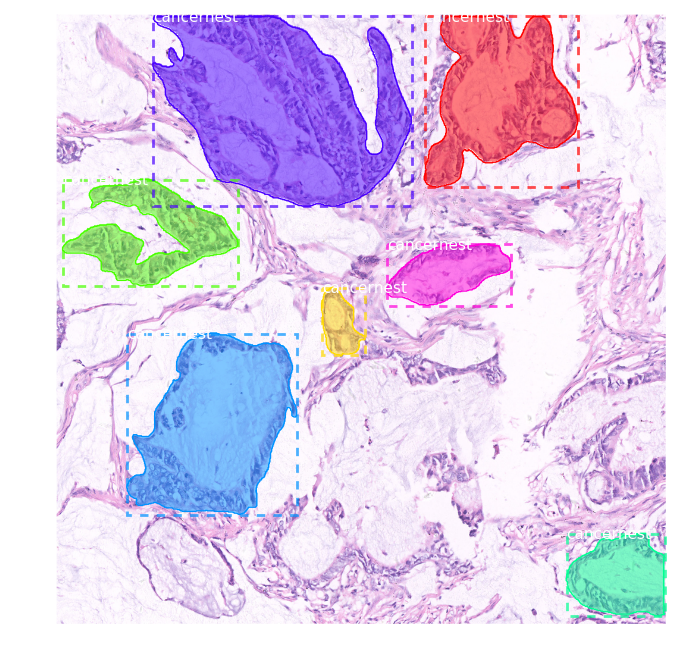
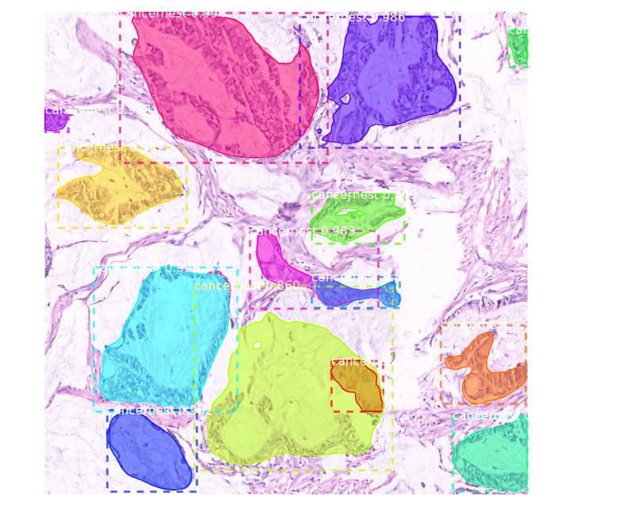

# I apply Mask R-CNN to detect the pathological section of gastric cancer
Here is a detection sample(rest is in the assets directory):
ground true
 
detection

Keras preprocessing source code should be modified if you want to use data augment

## Requirements
* Python 3.4+
* TensorFlow 1.3+
* Keras 2.0.8+
* Jupyter Notebook
* Numpy, skimage, scipy, Pillow, cython, h5py
